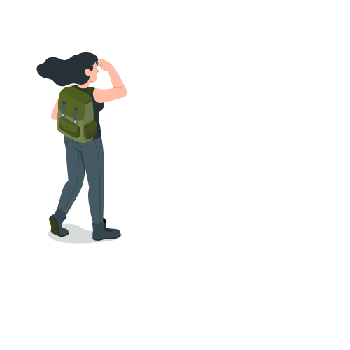

 ### 
WELCOME👋

 

 
 

&emsp; My name is Sarah, and I am a recent computer science graduate. I’ve used this space as a repository for my projects, course work, and to utilize version control. I am looking for opportunities to learn, contribute, and collaborate on open-source projects to enhance my skill set and make the world a better place.

### 
 Skills / Experience 

  
 
 
 

 
  

     

 

 
 

  

### 
About Me

Feel free to read on if you’d like to learn a little more about who I am and how I got here.

<ul>
<li>💻 Prior to writing my first line of code in 2021, I was on the path to becoming a Community Health Educator with a focus in Psychology. Research topics included sleep hygiene, nutrition, women’s health, mental health, and strength training. These are all fields of study I am still interested in and would love the opportunity to work on projects related to this content.</li> 
<li>📋 I’ve worked extensively in customer service, food service, and support based roles while attending school. This has provided a unique perspective when it comes to creating customer experience use cases.</li> 
<li>📚 I am curious by nature and have a genuine passion for learning new things. This inclination continues to enrich my life and is one of the reasons I found myself drawn to software development. There are so many opportunities to learn, grow, and connect with others!</li> 
<li>🌲 Connecting with nature plays an important role in my life. Whether it be on a trail, summiting a mountain, exploring the waters by kayak, or biking through the woods. It all brings a great sense of restoration, clarity, and peace. </li> 
<li>🗻 Hiking also exhibits a notable crossover to development, especially in terms of how one reacts when faced with a challenge. There will always be options. You can persist, take a break, seek alternate routes, ask for help, or even turn back. No matter which you choose, all offer valuable lessons. Yet, there’s still nothing quite like the feeling when you reach the summit or finally solve that problem.</li> 
<li>Also:

 🐈🏋️📷🎨🧶🎧🌱🌌</li>
</ul>

### 
 Socials 

                  

  

